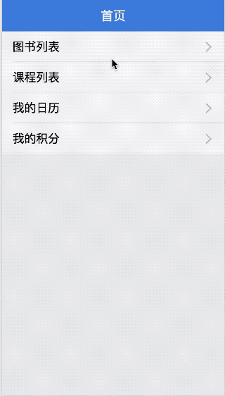
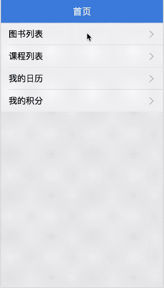
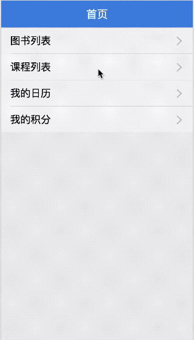

# 运行方法
```
npm install
npm start
```

# 关于React中状态保存的研究

在使用`react`搭配`react-router`做应用的时候，你可能遇到这样的问题，当我从第一个页面过渡到第二个页面，然后返回之后，发现之前的页面的状态全部不见了，即回到了初始的状态。

这点在页面存在多个TAB页或者多条件筛选的时候体验会更加明显，这时候我又不得不点击我之前选择的页签，重新选择筛选条件，然后再进行搜索。因此，在这种情况下，保存之前的状态显得尤为亟待解决，下面是自己实践出来的几种方法，做一下分享，同时希望和各位一起探讨，看能不能有什么更好的办法。

代码：[github](https://github.com/Rynxiao/react-perserve-state)

## 解决方案一：子路由方式

```javascript
// normal/routers/Books/Books.js
module.exports = {
    path: 'books',
    getComponent(nextState, cb) {
        require.ensure([], (require) => {
            cb(null, require('./components/Books'))
        })
    },
    getChildRoutes(partialNextState, cb) {
        require.ensure([], (require) => {
            cb(null, [
                require('./book')
            ])    
        })
    }
};

// normal/routers/Books/book.js
module.exports = {
    path: 'book/:id',
    getComponent(nextState, cb) {
        require.ensure([], (require) => {
            cb(null, require('./components/Book'))
        })
    }
};
```

配置图书列表下的嵌套路由可以查看图书详情。具体的路由跳转如下：

```javascript
// normal/routers/Books/components/Books.js

onLookDetail(id, book, index) {
    this.setState({ activeIndex: index });
    this.props.router.push({ pathname: `books/book/${id}`, query: book });
}

render() {
    const { children } = this.props;
    // ...
    
    // 如果有字路由组件，就渲染子组件
    if (children) {
        return children;
    }
    // ...
}
```

效果如下：



可以看到，当从详情页面返回时，点击的激活状态依旧可以保存，但是列表滚动的高度并不能够保存，关于高度的恢复在下面会讲到。

## 解决方案二：当前页面弹窗

不占用路由，在当前页面直接已弹窗的形式加载详情页面。

```javascript
// normal/routers/Books/components/Books.js
constructor(props) {
    super(props);
    this.state = {
        activeIndex: -1,
        books: [],
        modal: false
    };
}

onLookDetail(id, book, index) {
    this.setState({ activeIndex: index, modal: true });
}

onDetailBack() {
    this.setState({ modal: false });
}

render() {
    {
      // 根据state中的modal值来判断当前弹窗是否显示
      // 其实就是Book.js中的代码
      modal && (
        <div style={ styles.modal }>
            <Flex direction="column" style={ styles.wrapper }>
                <div style={ styles.header }>
                    <NavBar 
                        mode="dark"
                        leftContent="返回"
                        icon={<Icon type="left" />}
                        onLeftClick={ this.onDetailBack.bind(this) }>
                        图书详情
                    </NavBar>
                </div>
                <div style={ styles.content }>
                    <Card>
                        <Card.Header
                            title="标题"
                            thumb="xxx"
                            extra={ <span>{ book.title }</span> }/>
                        <Card.Body>
                            <div>{ book.description }</div>
                        </Card.Body>
                        <Card.Footer 
                            content="footer content" 
                            extra={<div>{ book.price }</div>} />
                    </Card>
                </div>
            </Flex>
        </div>
        )
    }
}
```

效果如下：



看上去效果十分好，既能保存状态，也能保存滚动条的高度。

## 解决方案三：本地存储/redux数据仓库/参数传递

我把这三种方案归结为一种，因为实际上是在离开列表组件的时候保存当前的状态，然后在回到页面的时候根据之前保存的状态来进行现场恢复而已。

```javascript
// src/routers/Books/components/Books.js

// 配合shouldComponentUpdate声明周期函数，避免不必要的渲染
shouldComponentUpdate(nextProps, nextState) {
    return !is(fromJS(this.props.books), fromJS(nextProps.books))
        || !is(fromJS(this.state), fromJS(nextState));
}

// 更新当前选中的activeIndex值，将其同步至redux中，然后再进行路由跳转
onLookDetail(id, book, index) {
    const { actions } = this.props;
    actions.updateBooks({ activeIndex: index });
    this.props.router.push({ pathname: `book/${id}`, query: book });
}

// 从redux中取值进行现场恢复
render() {
    const { books } = this.props;
    const list = books.books;
    const activeIndex = books.activeIndex;
    
    // ...
}

// src/reudx/reudcers/books.js
const initialState = {
    books: [],
    activeIndex: -1
};
```

效果如下：


效果和字路由方式相同，依然存在滚动高度不能保存的问题。

## 滚动高度问题

下面来谈谈如何解决滚动高度的问题，综合起来还是一种恢复现场的方式。在页面即将离开之前，保存之前的`scrollTop`值，然后再次回到这个页面的时候，恢复滚动高度即可。

```javascript
// src/reudx/reudcers/books.js
const initialState = {
    books: [],
    activeIndex: -1,
    // 添加scrollTop
    scrollTop: 0
};

// src/routers/Books/components/Books.js
componentDidMount() {
    const { actions, books } = this.props;
    const content = this.refs.content;
    const scrollTop = books.scrollTop;
  
    if (scrollTop > 0) {
        content.scrollTo(0, scrollTop);
    }
  
    setTimeout(() => {
        actions.getBooks();
    }, 150);
}

componentWillUnmount() {
    const content = this.refs.content;
    const { actions } = this.props;
    actions.updateBooks({ scrollTop: content.scrollTop });
}
```

效果如下：



## 尝试方案：react-keeper

在`github`上搜索看到了这个库，类似于`react-router`的一个翻版，同时在`react-router`的基础上增加了类似于`vue-router`中的`keep-alive`功能，这点暂时占坑，等做了案例之后再来填坑。


